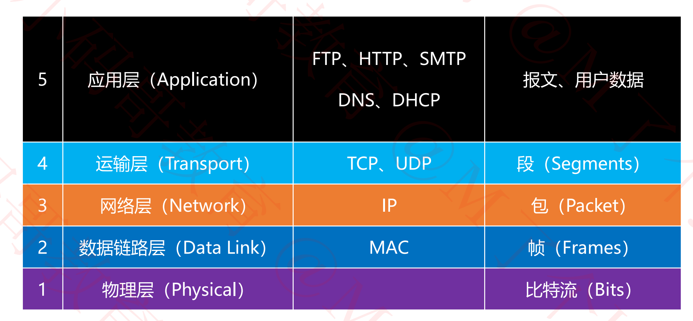
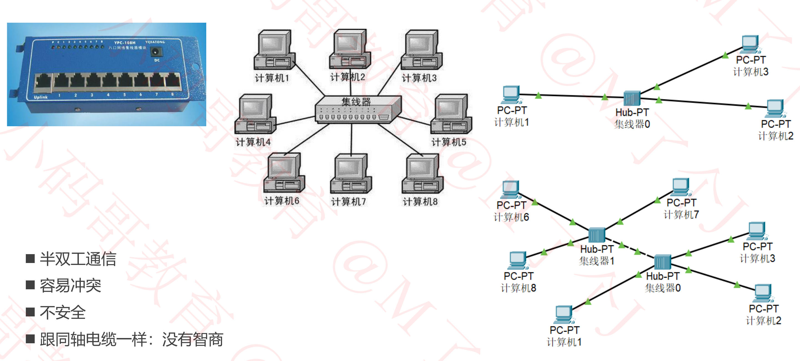
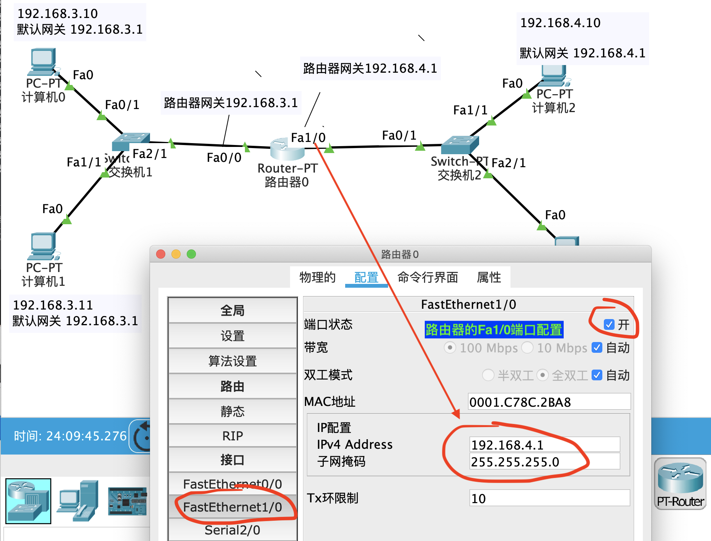
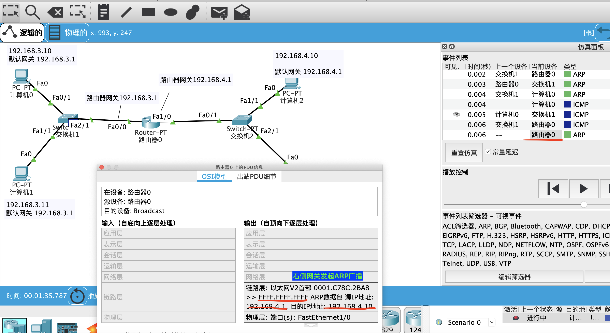
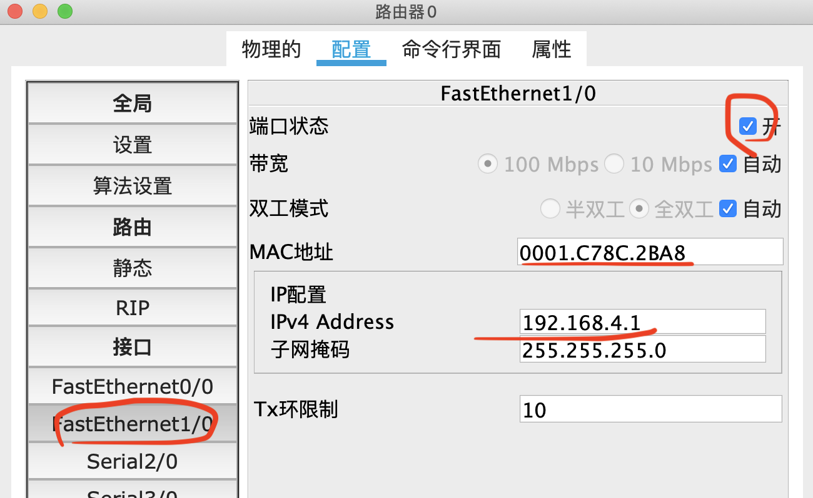

## 基本概念

### 互联网

+ 互联网的出现，彻底改变了人们的生活方式，足不出户就可以购物、聊天、看电影、买车票等
+ 思考： 数据是如何从一个设备传递到另一个设备的？
  + 这一切都是由网络协议规定的。没有网络协议，就没有今天的互联网

### 为什么学习网络协议

+ 互联网、移动互联网、物联网, 都离不开网络
  - 最熟悉的网络协议: HTTP
  - 为了满足各种需求，就有了各式各样的网络协议
+ 随着物联网，音视频，直播等领域的发展，企业提供了对开发人员网络基本功的要求，经常问网络协议相关的面试题
  - TCP和UDP的区别? 说一下它们的报文格式？
  - TCP的流量控制和拥塞控制? TCP如何实现可靠性传输?
  - 为什么连接时3次握手，关闭时4次挥手？
  - 七层模型和4层模型的区别? 每一层的作用是什么?
  - 交换机与路由器的区别?

### 网络互连模型

+ 为了更好的出尽互联网的研究和发展，国际标准化组织ISO1985年制定了网络互连模型

  - OSI参考模型(Open System Interconnect Reference Model), 具有7层结构

    

  

### 请求过程

### 网络分层

### 计算机之间的通信基础

+ 需要知道对方的IP地址
+ 最终是根据MAC地址(网卡地址), 输送数据到网卡, 被网卡接收
  - 如果网卡发现数据的目标MAC地址**是**自己，就会将数据传递给上一层处理
  - 如果网卡发现数据的目标MAC地址**不是**自己，就会将数据丢弃

### 计算机之间的连接方式- 网线直连

+ 需要用的是交叉线(不是直通线)

+ 广播是在同一个网段内进行传播的

+ ARP是有缓存的,

+ 要测试出ARP广播，在终端中执行arp -d命令，清除缓存

  

+ 在Packet tracer上进行测试, 当两台计算机用交叉线直连时，第一次发送PUD(ping)的过程

  - 基本配置

    

    

  - 第一次过程PUD数据包

    

    

    

    

    

    

    

  

  

### 计算机之间的连接方式 - 同轴电缆(Coaxial)

+ 同轴电缆是没有智商的，发出的ICMP数据到处跑，带有目的IP的MAC地址，当某台设备接收到消息时，如果发现是给自己的就接收，否则，就丢弃

### 计算机之间的连接方式 - 集线器(Hub)

+ 集线器也是没有智商的，每次都会发给所有的设备，占用网络资源

### 计算机之间的连接方式 - 网桥(Bridge)

+ 当网桥知道了计算机6和计算机7的MAC地址后，当计算机6给计算机7发送数据时，当数据通过达到网桥时，网桥通过MAC地址发现，这两个设备在同一侧，那么就不会让这个数据通过网桥了。从而达到了隔绝冲突域名的目的
+ 当计算机机6给计算机2发送数据时，当通过ICMP发送数据时，发现不知道计算机2的MAC地址，则发送ARP广播，集线器没有智商，所以通过集线器1时，数据被发送给所有连接集线器的设备，当数据发送给网桥0时，网桥记录左侧接口计算机6对应的MAC地址，ARP广播通过网桥0时继续传播，当传递给计算机2后，计算机2发现目的IP是自己，则ARP返回响应，到达网桥0的右侧时，计算机2的MAC地址被记录。

### 计算机之间的连接方式 - 交换机(Switch)

+ <u>**交换机**</u>是局域网的最终解决方案，但是如果要跨网段时需要路由器

+ 交换机直连连接计算机，能够学习知道每个计算机的MAC地址，然后在通信时，能够直接把数据发送给对应的设备
+ 为什么比集线器安全?
  + 因为真正发送数据时，会把数据直接发送给对应的设备，而不会发给无关的设备

+ 全球所有的设备都用交换机连接会是什么情况?
  - 交换机适用于局域网，设备在同一个网段
  - 如果全球直连，那么发送ARP时，所有的计算机都会收到，资源占用太大等等问题
  - 全球设备连接，必须用到路由器，解决不同网段之间的连接问题

### 计算机之间的连接方式 - 路由器(Router)

+ 路由器功能测试

  - 基本配置信息

    

    

    

  - 当计算机0要给计算机1发送信息时（在同一个网段内）

    - 发送ICMP时，发现不知道计算机1的MAC地址
    - 同时发现计算机1的IP地址跟自己在同一个网段内，那么就给计算机1发送ARP广播。 
    - ARP广播经过交换机1，被发送给计算1和路由器0的左侧网关。
    - 路由器0的左侧网关的IP为192.168.3.1，不是目的IP，则把ARP广播丢弃。
    - 计算机1的恰好为目的IP，那么将回送ARP响应，响应经过交换机1时，目的MAC为计算机0的MAC地址，交换机已经记录了该MAC地址，所以直接将该ARP响应发送给计算机0。
    - 计算机0知道了计算机1的MAC地址，然后就发送ICMP，经过交换机1时，交换机直接把ICMP发送给计算机1

  - 当计算机0要给计算机1发送信息时(不在同一个网段内)

    - 发送ICMP时，发现不知道计算机1的MAC地址

      

    - 同时发现计算机1的IP地址跟自己不在同一个网段内，那么就给自己的默认网关192.168.3.1发送ARP广播。

      

    - 当ARP到达交换机1时，从Fa0/1输入，从Fa1/1, Fa2/1输出。从下图可以看出，该广播在链路层并没有改变。

      

      

    - 交换机1从Fa1/1输出给计算机1，目的IP不匹配，数据被丢弃

      

      

    - 交换机1从Fa2/1输出ARP给路由器0，路由器0的Fa0/0的网关IP为192.168.3.1,恰好为目的IP，得到此时该网关对应的MAC地址后，则返回ARP响应，源MAC地址为网关Fa0/0的MAC地址，目的MAC地址为计算机0的MAC地址。

      

      

    - ARP从路由器0传输到交换机0，交换机具有记忆功能，知道目的MAC地址为计算机0，所以直接从Fa0/1端口将数据传递给计算机0

      

    - 计算机0收到交换机1，传输过来的ARP数据,从而知道了默认网关192.168.3.1的MAC地址

      

      

    - 此时计算机0，发送ICMP消息

      

      

    - 交换机0收到ICMP数据，从Fa0/1输入，从Fa2/1输出给路由器0

      

    - 从路由器0的Fa0/0端口进入，不知道目的IP的网关地址。

      

      

    - 然后发现目的IP为192.168.4.10, 跟右边的网关192.168.4.1的网段相同，则由右边的网关发起ARP广播去寻找目的IP对应的MAC地址 (假如路由器有缓存时，可以通过开关网关来清除缓存)

      

      

    - 然后将广播发给交换机2，交换机2将ARP广播发送给计算机2，计算机3。计算机3将ARP丢弃，计算机2将ARP发送回来，源MAC地址为计算机2的MAC地址，目的MAC地址为右侧网关的MAC地址。再经过交换机2，发送给路由器0。此时路由器0知道了计算机2的MAC地址，然后发送ICMP数据。

+ 小结
  - 在同一个网段内
    - 计算机0和计算机1在同一个网段内，则直接发送ARP广播,找到计算机1的MAC地址
    - 然后计算机0再发送ICMP
  - 不在同一个网段内
    - 计算机0 `192.168.3.10`给计算机2 `192.168.4.10`发送数据，发现两者不在同一个网段内。
    - 那么计算机0先给自己的默认网关发送一个ARP广播（目的IP为默认网关192.168.3.1），获取自己默认网关的MAC地址
    - 计算机0发送ICMP到达默认网关对应的路由器，发现路由器的某个端口跟计算机2 `192.168.4.10`在同一个网段
    - 则由这个网关发送一个ARP请求，找到计算机2 `192.168.4.10`对应的MAC地址，然后再发送ICMP请求

+ 同一个网段内的计算机用路由器连接，为什么不能通信?

  

  - 计算机0要与计算机1通信，发现是同一个网段内的计算机，通信时直接发送ARP广播，源IP为192.168.1.10 ， 目的IP为192.168.1.11 ，而路由器是隔绝广播域的，广播是不同传递给计算机1的，因此不能通信