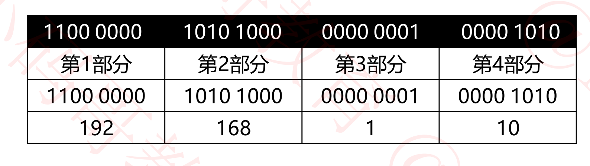

## MAC地址和IP地址

### MAC地址

+ 每一个网卡都有一个6字节(48bit)的MAC地址 （Media Access Control Address）
+ 全球唯一，固化在了网卡的ROM中，由IEEE802标准规定
  - 前3字节: OUI (Organizationally Unique Identifier), 组织唯一标识符,
    - 由IEEE的注册管理机构分配给厂商
  - 后3个字节: 网络接口标识符
    - 由厂商自行分配
+ OUI查询
  - http://standards-oui.ieee.org/oui.txt
  - https://mac.51240.com/

+ 表示格式
  - windows: 40-55-82-0A-8C-6D
  - Linux, android , mac ,ios : 40:55:82:0A:8C:6D
  - Packet Tracer 4055. 820A.8C6D
  - 当48位全是1时，代表广播地址 FF-FF-FF-FF-FF-FF

### MAC地址操作

+ 查看MAC地址: ipconfig /all

+ 修改MAC地址

  - 更改适配器选项 - 属性 - 配置 - 高级 - 网络地址

  - 填写的时候需要把分割号去掉

    

+ 有时可以通过修改MAC地址蹭网

### MAC地址的获取

+ 当不知道对方主机的MAC地址时，可以通过发送ARP广播获取对方的MAC地址

  - 获取成功后，会焕春IP地址、MAC地址的映射信息，俗称ARP缓存
  - 通过ARP广播获取的MAC地址，属于动态(dynamic)缓存
  - 存储时间比较短(默认是2分钟)， 过期了就自动删除

+ 相关命令

  - arp -a [主机地址] : 查询ARP缓存

  - arp -d [主机地址]: 删除ARP缓存

  - arp -s 主机地址 MAC地址: 增加一条缓存（这是静态缓存,存储时间较久，不同的系统时间不同）

    

### IP地址

+ IP地址： 互联网上的每个主机都有一个IP地址

  - 最初是IPv4版本，32bit, 2019粘11月25日，全球IP地址已经用尽了
  - 后面退出了IPv6版本, 128bit (16字节)

+ 课件中默认为IPv4版本

  

### IP地址的组成

+ IP地址由2部分组成: 网络标识(网络ID)，主机标识（主机ID）

  - 通过子网掩码(subnet mask) 可以知道网络ID, 主机ID

    

+ 主机所在的网段 = 子网掩码 & IP地址

  

  

+ 计算机和其他计算机通信前， 会先判断目标主机和自己是否在同一个网段

  - 同一网段: 不需要由路由器进行转发
  - 不同网段: 交由路由器进行转发

### IP地址的分类

+ 使用ping给某个网段内的全部主机发数据

+ 通过网络ID的开头来判断到底属于哪种地址
+ 对于A类地址，默认子网掩码为255.0.0.0,当子网掩码多余8位时，则该A类地址又划分出新的子网。

### A类地址

### B类地址

### C类地址

### D类， E类地址

### 子网掩码的CIDR表示方法

+ CIDR（Classless Inter-Domain Douting）: 无类别域间路由
+ 子网掩码的CIDR表示方法
  - 192.168.1.100/24， 代表子网掩码有24个1，即为255.255.255.0
  - 123.210.100.200/16, 代表子网掩码有16个1， 即为255.255.0.0

+ 计算工具: https://www.sojson.com/convert/subnetmask.html

  

### 为什么进行子网划分?

### 子网划分

+ 子网划分: 借用主机位作为子网位，划分出多个子网
+ 可用分为:
  - 等长子网划分: 将一个网段等分成多个子网，每个子网的可用IP地址数量是一样的
  - 变长子网划分: 每个子网的可用IP地址数量可以是不一样的
+ 子网花分器: http://www.ab126.com/web/3552.html
+ 子网划分的步骤
  - 确定子网的子网掩码长度
  - 确定子网中第1个，最后1个主机可用的IP地址

### 等长子网划分- C类等分为2个子网

+ 将原来的192.168.0.0/24网段，划分成两个子网

  - A子网

    - 子网掩码: 255.255.255.128/25

    - 主机可用IP地址为192.168.0.1 ~ 192.168.0.126

      - `192.168.0.0`   表示网段，不能用做IP地址
      - `192.168.0.127`  该网段的广播地址

      

  - B子网

    - 子网掩码: 255.255.255.128/25

    - 主机可用IP地址为 192.168.0.129 ~  192.168.0.254

      - `192.168.0.128`   表示网段，不能用做IP地址
      - `192.168.0.255`   该网段的广播地址

      

### 等长子网划分- C类等分为4个子网

### 等长子网划分- C类等分为4个子网的广播地址

### 等长子网划分- C类等分为8个子网

### 等长子网划分- B类子网划分

### 等长子网划分- A类子网划分

### 变长子网划分

### 超网

### 合并4个网段

### 合并网段的规律

### 判断一个网段是子网还是超网

