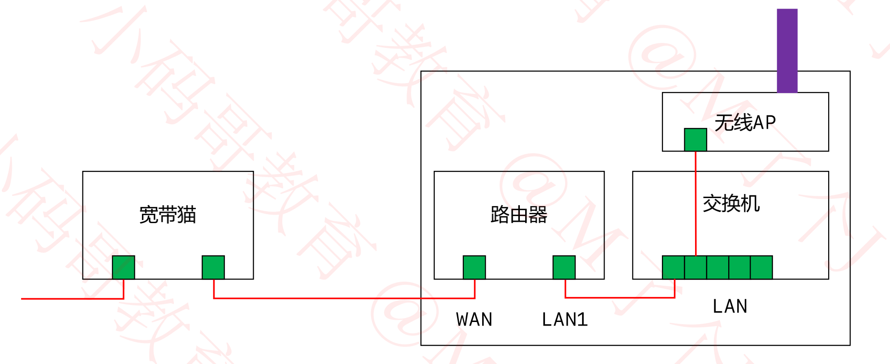
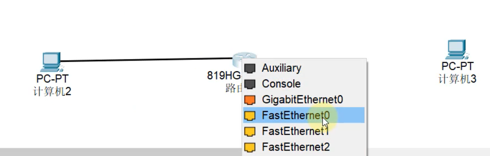

## 路由

### 基本概述

+ 在不同网段之间转发数据，需要有路由器的支持
+ 默认情况下，路由器只知道跟它直连的网段，非直连的网段需要通过静态路由，动态路由告诉它
  - 静态路由
    - 管理员手动添加路由信息
    - 适用于小规模网络
  - 动态路由
    - 路由器通过路由选择协议(比如RIP, OSPF)自动获取路由信息
    - 适用于大规模网络

### 练习1- 让下面4台主机之间可以互相通信


+ 通过对路由器配置**静态路由表**进行路由器之间的通信

+ 假设计算机0要与计算机3通信时，那么路由器0要知道怎么去找到计算机3？

  - 计算机0发出请求，目的IP为193.169.1.10,当通过网关192.168.1.1到达了路由器0后，需要知道下一跳的地址。

  - 当配置了静态路由后，就知道了下一跳该怎么走了

    

+ 让4台主机之间可以互相通信，路由器0的路由表为

  + 第一种: 按网段进行配置

    | 网络        | 子网掩码      | 下一跳      |
    | ----------- | ------------- | ----------- |
    | 193.169.1.0 | 255.255.255.0 | 194.170.1.2 |
    | 193.169.2.0 | 255.255.255.0 | 194.170.1.2 |

  + 第二种: 指定IP的路由

    | 网络         | 子网掩码                    | 下一跳      |
    | ------------ | --------------------------- | ----------- |
    | 193.169.1.10 | 255.255.255.255(代表指定IP) | 194.170.1.2 |
    | 193.169.2.10 | 255.255.255.255             | 194.170.1.2 |

  + 第三种:默认路由,即为不知道往哪走时，就往这里走

    | 网络    | 子网掩码 | 下一跳      |
    | ------- | -------- | ----------- |
    | 0.0.0.0 | 0.0.0.0  | 194.170.1.2 |

  + 第四种汇总路由

    | 网络        | 子网掩码    | 下一跳      |
    | ----------- | ----------- | ----------- |
    | 193.169.0.0 | 255.255.0.0 | 194.170.1.2 |

    | 网络      | 子网掩码  | 下一跳      |
    | --------- | --------- | ----------- |
    | 193.0.0.0 | 255.0.0.0 | 194.170.1.2 |

+ 同理，路由器1的路由表为

  + 第一种: 按网段进行配置

    | 网络        | 子网掩码      | 下一跳      |
    | ----------- | ------------- | ----------- |
    | 192.168.1.0 | 255.255.255.0 | 194.170.1.1 |
    | 192.168.2.0 | 255.255.255.0 | 194.170.1.1 |

  + 第二种: 指定IP的路由

    | 网络         | 子网掩码                    | 下一跳      |
    | ------------ | --------------------------- | ----------- |
    | 192.168.1.10 | 255.255.255.255(代表指定IP) | 194.170.1.1 |
    | 192.168.2.10 | 255.255.255.255             | 194.170.1.1 |

  + 第三种:默认路由,即为不知道往哪走时，就往这里走

    | 网络    | 子网掩码 | 下一跳      |
    | ------- | -------- | ----------- |
    | 0.0.0.0 | 0.0.0.0  | 194.170.1.1 |

  + 第四种汇总路由

    | 网络        | 子网掩码    | 下一跳      |
    | ----------- | ----------- | ----------- |
    | 192.168.0.0 | 255.255.0.0 | 194.170.1.1 |

    | 网络      | 子网掩码  | 下一跳      |
    | --------- | --------- | ----------- |
    | 192.0.0.0 | 255.0.0.0 | 194.170.1.1 |

  

### 练习2- 让下面4台主机之间可以互相通信


### 数据包的传输过程

+ 这里仅仅是简述一下数据包的传输过程，后面详细学到网络分层时，会再次讲解数据包的传输过程

  

+ 源IP和目标IP未改变，中间过程中源MAC地址和目标MAC地址不断改变

### 网络，互联网，因特网


### ISP

+ ISP,Internet Service Provider , Internet 服务提供商，比如移动，电信，网通，铁通等

+ 我们平时拉的宽带都是通过ISP连接到Internet的

  

### 服务器机房


### 网络分类


### 常见的几种接口


### 上网方式-电话线入户


+ 这就是平时说的: ADSL电话拨号上网(Asymetric Digital Subscriber Line)
  - 非对称数字用户线路，提供上下行不对称的传输带宽
+ 猫(Modem), 调制解调器，进行数字信号和模拟信号的转换
+ 电话线传递的是模拟信号，通过猫将模拟信号转换成数字信号0101，最终传递给电脑
+ LAN端口与电脑连接， WAN端口与广域网连接
+ 通过猫连接路由的WAN端口接收数字信号

### 上网方式-光纤入网户


+ 光猫(Optical Modem), 光调制解调器，进行数字信号和光信号的转换

### 上网方式-网线入网户


### 家用无线路由器的逻辑结构



+ 对于家用路由器，可以理解里面有个交换机，家里的电脑等设备通过网线或wifi连接到交换机上，构成一个局域网。

### 公网IP, 私网IP

+ IP地址也分为: 公网IP, 私网IP

+ 公网IP（Public）
  - Internet上的路由器中只有到达公网的路由表，没有到达私网的路由表
  - 公网IP由**因特网信息中心**统一分配管理
  - ISP需要向Inter NIC申请公网IP
+ 私网IP（Private）
  - 主要用于局域网。 下面是保留的私网网段
    - A类: 10.0.0.0/8, 1个A类网段
    - B类: 172.16.0.0/16 ~ 172.31.0.0/16, 16个B类网段
    - C类: 192.168.0.0/24 ~ 192.168.255.0/24, 256个C类网络

### NAT

+ 私网IP访问Internet需要进行NAT转换为公网IP

  - NAT（Network Addresss Translation）
  - 这一步可以由路由器来完成

+ NAT的特点

  - 可以节省公网IP资源
  - 会隐藏内部真实IP

+ NAT的分类

  - 静态转换

    - 手动配置NAT映射表
    - 一对一转换

  - 动态转换

    - 定义外部地址池，动态随机转换
    - 一对一转换

  - PAT（Port Address Translation）

    - 多对一转换，最大程度节约公网IP资源

    - 采用端口多路复用方式，通过端口号表示不同的数据流

    - 目前应用最广泛的NAT实现方式

      ```
      192.168.1.10:123123 ->  200.0.0.10:23123
      192.168.1.11:5435 ->  200.0.0.10:5435
      192.168.1.12:7676 ->  200.0.0.10:7676
      ```

      

+ 不同局域网的中的私网IP可能是一样的，但是进行公网通信时会转换成不同的公网IP
+ 从私网发出数据给公网，从路由器出去时，都会通过NAT技术，将私网IP转换成公网IP，源IP会改变

+ 通过百度查询本机IP

  

  - 这个查到的ip通常是经过多次NAT转换后的，最接近公网的路由器的地址，而不一定是你的路由器地址。

  

### 不同类型的路由器

+ 可以直连同一个网段的设备

  

  

  

  

### 第一个包丢失


+ 当通过ARP找到路由器左边的MAC地址后，通过ICMP发送数据给路由器0，发现目的IP是192.168.2.10，但此时不知道目的IP对应的MAC地址，将此次ICMP丢弃，然后发送ARP去寻找目的IP对应的MAC。因此第一个包丢失。

