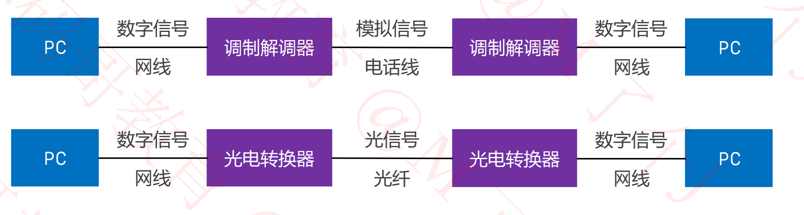

## 物理层

### 网络互连模型

+ 为了更好的促进互联网络的研究和发展，国际标准化组织ISO在1985年制定了网络互连模型

  - OSI参考模型(Open System Interconnect Reference Model),具有7层结构

    

### 请求过程

### 网络分层

### 物理层

+ 物理层定义了接口标准，线缆标准，传输速率，传输方式等

  

### 数字信号，模拟信号

+ 模拟信号
  - 连续的信号，适合长距离传输
  - 抗干扰能力差，受到干扰时波形变形很难纠正
+ 数字信号
  - 离散的信号，不适合长距离传输
  - 抗干扰能力强，收到干扰时波形失真可以修复

### 数据通信模型

+ 局域网通信模型

  + 注意： 网线不超过100米

    

+ 广域网通信模型

  

### 信道(Channel)

+ 信道: 信息传输的通道，一条传输介质上(比如网线)上可以有多条信道
+ 单工通信
  - 信号只能往一个方向传输，任何时候不能改变信号的传输方向
  - 比如无线电广播，有线电视广播
+ 半双工通信
  - 信号可以双向传输，但必须是交替进行，同一时间只能往一个方向传输
  - 比如对讲机
+ 全双工通信
  - 信号可以同时双向传输
  - 比如手机（打电话，听说同时进行）

