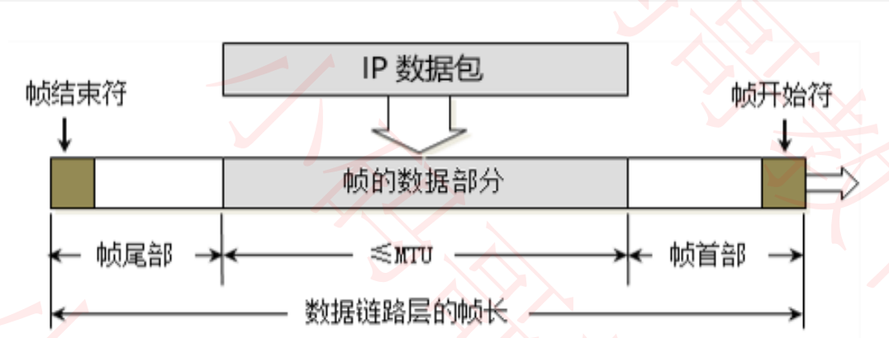
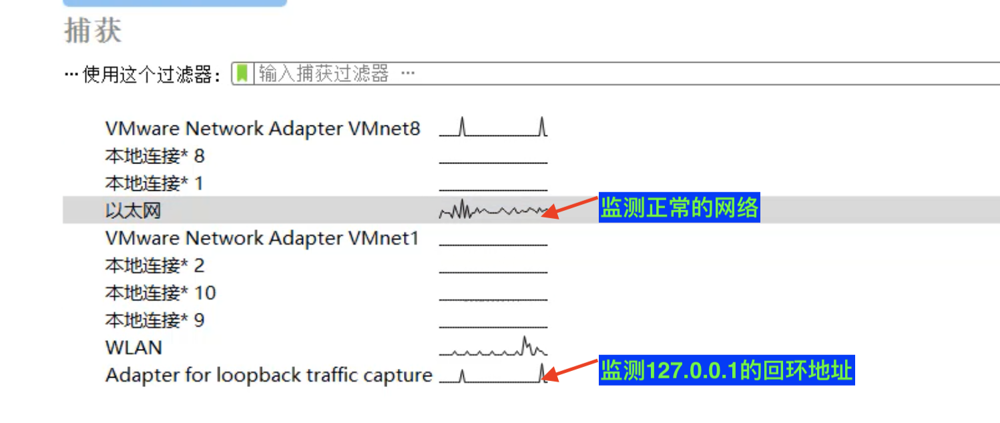

## 数据链路层(Data Link)

### 基本概念

+ 链路：从1个节点到相邻节点的一段物理线路(有线或无线)，中间没有其他交换节点

  

  - 局域网之间的链路层走CSMA/CD协议
  - 路由器之间的链路层走PPP协议
  - 从CSMA/CD协议到PPP协议的过程中，先把CSMA/CD协议加的帧的首部和尾部去掉，然后用PPP协议格式的首部和尾部封装数据
  - 链路层传输时，源IP和目的IP不会变，但是数据帧的首部和尾部会变，即源MAC和目的MAC会变。

+ 数据链路: 在一条链路上传输数据时，需要有对应的通信协议来控制数据的传输

  - 不同类型的数据链路，所用的通信协议可能是不同的
    - 广播信道：CSMA/CD协议(比如同轴电缆，集线器等组成的网络)
    - 点对点信道: PPP协议(比如2个路由器之间的信道)

+ 数据链路层的3个基本问题

  - 封装成帧
  - 透明传输
  - 差错检验

### 数据链路层- 封装成帧

+ 帧(Frame) 的数据部分
  - 就是网络层传递下来的数据包(IP数据包， Packet)
+ 最大传输单元MTU(Maximum Transfer Unit)
  - 每一种数据链路层协议都规定了所能够传输的帧的数据长度上限
  - 以太网的MTU为1500字节

### 数据链路层- 透明传输

+ 使用SOH(Start Of Header)作为帧开始符

+ 使用EOT(End Of Transmission)作为帧结束符

+ 数据部分一旦出现了SOH、EOT就需要转义

  

### 数据链路层- 差错检验

+ FCS是根据数据部分+首部计算得出的
+ 当接收端接收到数据时，也计算一次FCS，看两次的FCS是否一致。

### CSMA/CD 协议

+ CSMA/CD (Carrier Sense Multiple Access with Collision Detectio)
  - 载波侦听多路访问/冲突检测
  - 载波侦听: 协议规定当PC要发送数据时，先检测信道上有没有数据在发送，如果有就不发送
  - 多路访问:指的是所有的PC都可以发送数据
  - 冲突检测: 当多个PC发现自己的信道没有数据时，同时发送了数据，这个时候数据到达集线器后，冲突，回弹。所以该协议要有能力判断该数据是别人发送的数据，还是自己回弹的数据
  - 集线器是半双工通信，使用的就是CSMA/CD协议
+ 使用了CSMA/CD的网络可以称为以太网(Ethernet), 它传输的是以太网帧
  - 以太网帧的格式有: Ethernet V2标准， IEEE的802.3标准
  - 使用最多的是: Ethernet V2标准
+ 为了能够检测正在发送的帧是否产生了冲突，以太网的帧至少要64字节
+ 用交换机组建的网络，已经支持全双工通信，不需要再使用CSMA/CD，但它传输的帧依然是以太网帧
  - 所以，用交换机组件的网络，依然可以叫做以太网

###  Ethernet V2帧的格式

+ 首部: 目标MAC+源MAC+网络类型

+ 以太网帧:首部 + 数据 + FCS

+ 数据的长度至少为是: 64 - 6 - 6 - 2 - 4 = 46字节

+ 当数据部分的长度小于46字节时

  - 数据链路层会在数据的后面加入一些自己填充

  - 接收端会将添加的字节去掉

    

+ 长度总结
  - 以太网帧的数据长度: 46 ~1500字节
  - 以太网帧的长度为: 64 ~ 1518字节 (目标MAC + 源MAC + 网络类型 + 数据 + FCS)

### PPP协议 (Point to Point )

+ Address字段: 图中的值为0xFF，形同虚设，点到点不需要源MAC和目的MAC
+ Control字段: 图中的值为0x03, 目前没有什么作用
+ Protocol字段: 内部用到的协议类型
+ 帧开始符，帧结束符:0x7E

+ 字节填充

  

  + 将0x7E替换成0x7D5E
  + 将0x7D替换成0x7D5D

### 网卡

+ 网卡接收到一个帧，首先会进行差错校验，如果校验通过则接收，否则丢弃
+ WireShark抓到的帧没有FCS，因为它抓到的是差错校验通过的帧(帧尾的FCS会被硬件去掉)
  - WireShark抓不到差错校验失败的帧

+ 网卡工作在数据链路层和物理层
+ 交换机工作在数据链路层和物理层（交换机还会目标MAC和源MAC）
+ 路由器工作在网络层，数据链路层和物理层（路由器还需要知道目标IP）
+ 集线器工作在物理层（ 集线器直接传输数据)

### WireShark查看

+ `ping baidu.com`查看ICMP数据

  

  

  

  