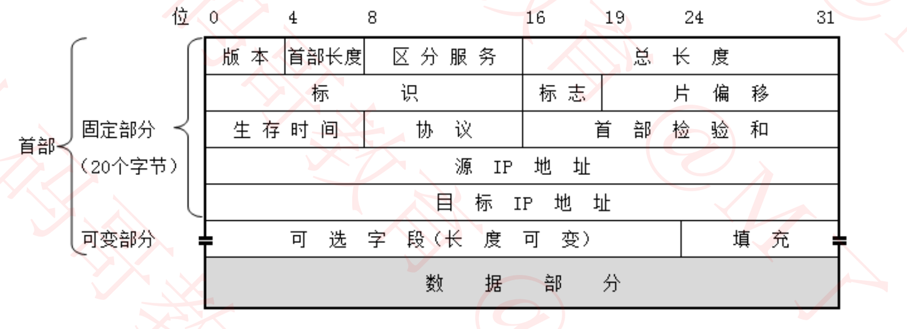
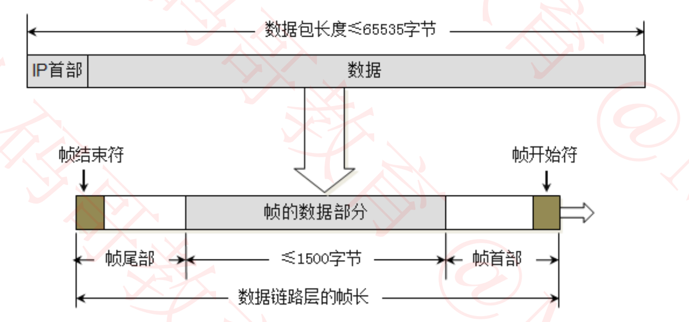
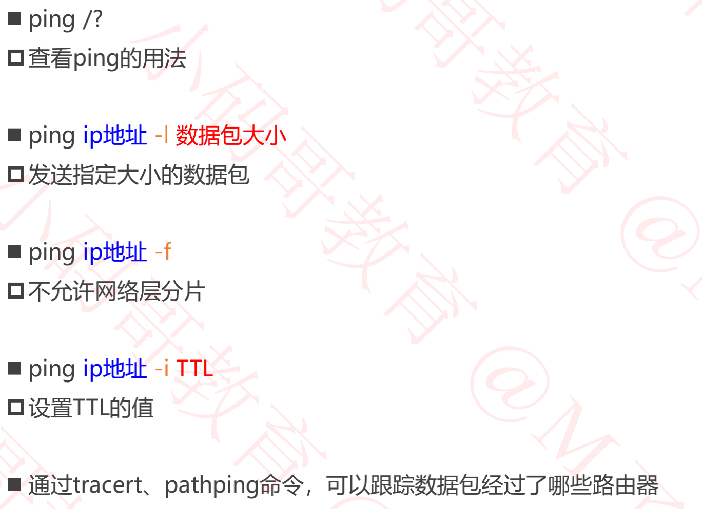
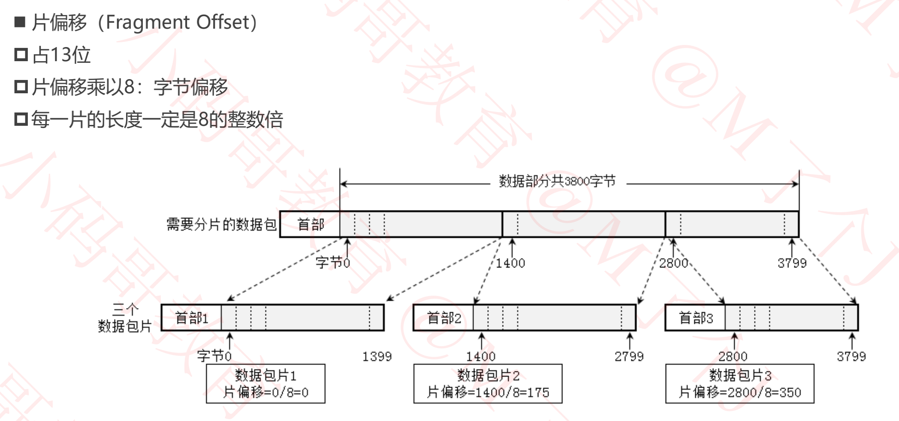
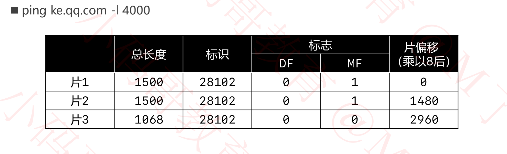
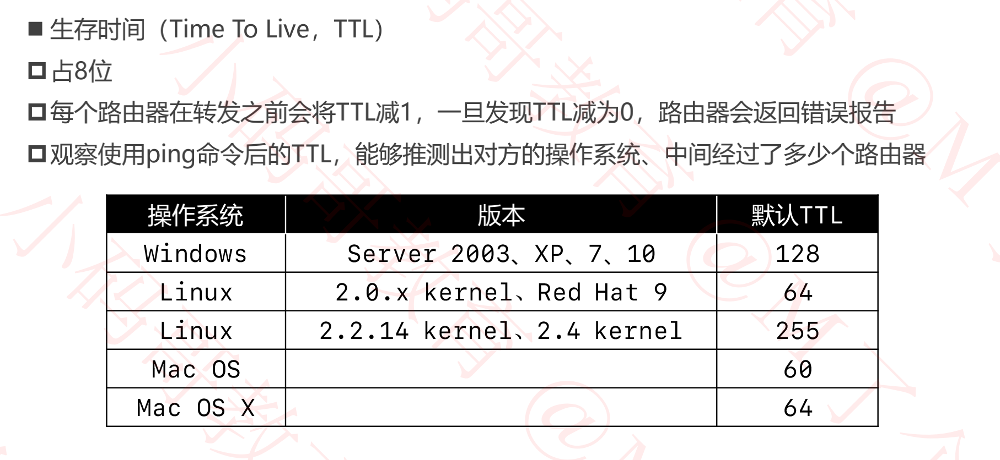
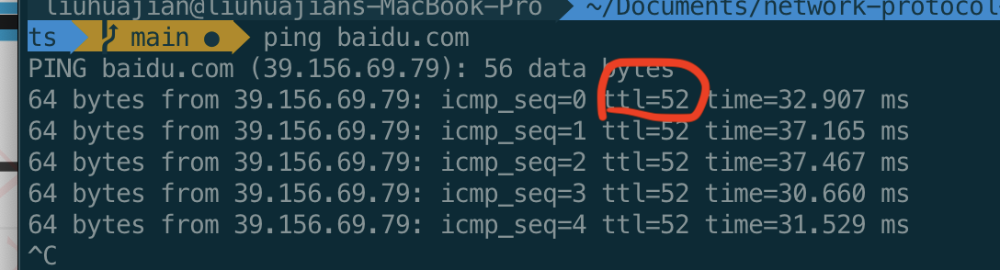
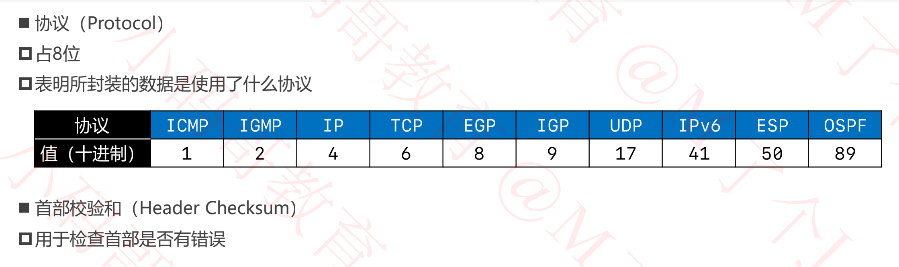
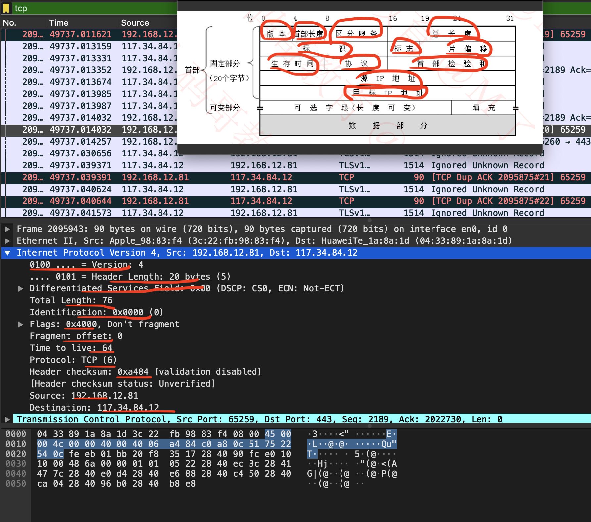

## 网络层

### 基本概念

+ 网络层数据包(IP数据包, Packet) 由首部，数据2部分组成

  - 数据:很多时候是由传输层传递下来的数据段(Segment)

  

### 版本、首部长度、区分服务

+ 版本 (Version)
  - 占4位
  - 0b0100:IPv4
  - 0b0110:IPv6

+ 首部长度(Header Length)
  - 占4位, 二进制乘以4才是最终长度
  - 0b0101: 5 * 4 = 20 (最小值)
  - 0b0101: 15 * 4 = 60 （最大值）
+ 区分服务(Differentiated Services Field)
  - 占8位
  - 可以用于提高网络的服务质量(QoS， Quality of Service)
  - 假设设置了某些特殊的值，路由器会让这些数据优先通过

### 总长度

+ 占16位

+ 首部+数据的长度之和，最大值是65535

  

+ 由于帧的数据不能超过1500字节，所以过大的IP数据包，需要分片(fragments)传输给数据链路层
  
  - 每一片都有自己的网络层首部(IP首部)

### 标识

+ 占16位
+ 数据包的ID, 当数据包过大进行分片时，同一个数据包的所有片的标识是一样的
+ 有一个计数器专门管理数据包的ID, 每发出一个数据包，ID就增加1

### 标志

+ 占3位

  - 第1位（Reserved Bit）: 保留

  - 第2位（Don't Fragment）: 1代表不允许分片、0代表允许分片

    ```
    默认情况下都是允许分片的
    ```

  - 第3位（More Fragments）:1代表不是最后一片、0代表是最后一片

    ```
    接收方在网络层，将数据拼接起来，根据第3位确定是否为最后一片，
    根据偏移和长度确认怎么拼接
    ```

    

### ping - 几个用法



### 片偏移





### 生存时间



+ 由于某些异常，例如路由表配置有问题，导致数据包一直在网络中传输，此时可以通过这个生存时间将其丢弃掉，防止一直占用网络带宽

+ 百度响应的数据包最终的的TTL为52，而一般数据不会经过太多的路由器，所以可以推断百度的服务器部署在TTL为64的Linux服务器上

  

### 协议、首部校验和



+ 首部校验和最开始全部为0，当首部其他数据确认后，就计算出一个校验值，填到这个位置

### 使用 WireShark查看

