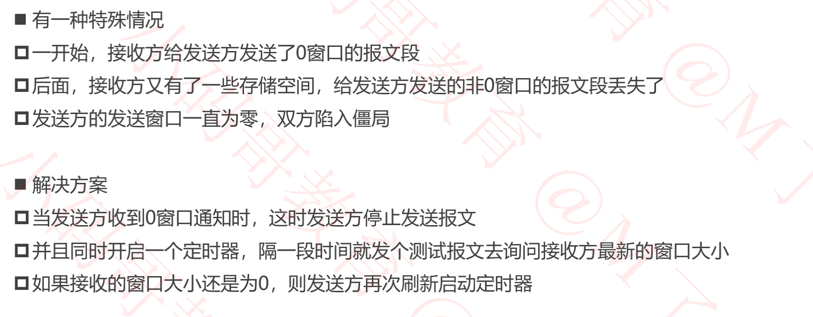

## 传输层

### 传输层


### UDP -数据格式


### UDP -校验和


### 使用WireShark查看


### 端口


```
设置防火墙，使外部TCP访问服务器3306端口不可见。从而增加服务器安全性。
外部要访问数据时，通过http或https请求服务器，然后服务器内部访问数据库，然后返回给外部。

```

### TCP数据格式


+ 数据偏移

  - 占4位:则取值范围为0x0101~0x1111

  - 该值乘以4, 即为<u>TCP首部的长度</u>  (固定的20字节首部 + 可变部分)
  - 因此TCP首部最少是20个字节，最多为60个字节

  - 跟网路层首部长度的规则一样

  - 为什么叫数据偏移?

    - 可以理解为TCP首部的长度，即为该TCP数据所包含的上层数据的偏移

    

+ 保留位
  
  - 占6位，目前全部为0

### TCP - 小细节


+ 有些资料中，TCP首部的保留字段占3位，标志(Flags)占9位。 标志位为9位时，前3位现在是没什么用的，所以有的资料说标志位是6位，也没问题。

+ 在WireShark中查看

  

  

### TCP - 小细节


### TCP - 检验和(Checksum)


### TCP - 标志位(Flags)

+ URG (Urgent)
  - 当URG=1时，紧急指针字段才有效。表明当前报文段有紧急数据，应该优先传送。
  - 当URG=1时，假设此时紧急字段为8，那么表明TCP数据部分的前8个字节的数据是紧急数据
+ ACK (Acknowledgment)
  - 当ACK=1时，确认号字段才有效
+ PSH (Push)
  - 一般用于交互式网络，不用关心
+ RST (Reset)
  - 当RST=1时，表明连接中出现严重错误，必须释放连接，然后再建立新的连接

+ SYN (Synchronization)
  - 当SYN=1、ACK=0时，表明这是一个建立连接的请求
  - 若对方同意建立连接，则回复SYN=1、ACK=1
+ FIN (Finish)
  - 当FIN=1时，表明数据已经发送完毕，要求释放连接

### TCP- 序号、确认号、窗口

+ 序号(Sequence Number)
  - 占4个字节
  - 首先, 在传输过程的每一个字节都会有一个编号
  - 在建立连接后，序号代表:这一次传给对方的TCP数据部分的第一个字节的编号

+ 确认号 (Acknowledgment Number)
  - 占4字节
  - 在连接建立后，确认号代表，希望对方下一次传过来的TCP数据部分的第一个字节的编号

+ 窗口 (Window)
  - 2字节
  - 这个字段有流量控制功能，用以告知对方下一次允许发送的数据大小(字节单位)

```
客户端与服务器3次握手建立连接手，客户端请求之后，假设服务器响应了300字节的数据，
并分为3次响应给客户端

服务器在响应给客户端的1~100字节的数据时，TCP首部序号为1，即为第一个字节的偏移。当客户端收到了，服务器的1~100字节的数据时，客户端向服务器发送响应，此时的tcp首部中的确认号为101，表明希望服务器下次响应的数据的第一个字节的编号为101
```


### TCP的几个要点

+ 可靠传输
  - 有个定时器，发现时间到达时，还没收到确认就重传，停止等待ARQ协议
+ 流量控制
  - 两台设备，点对点，端对端的
  - 通信的时候告诉对方自己的接收窗口的限制
+ 拥塞控制
  - 在流量控制的基础上，进一步控制发送窗口的大小，来保证整个网络比较通畅
+ 连接管理
  - 建立连接
  - 释放连接

### TCP - 可靠传输 - 停止等待ARQ协议

+ ARQ (Automatic Repeat-reQuest)，自动重传请求

  - 效率比较低，必须一个确认回来之后才能发送下一个

  

  

### 疑问

+ 若有个包重传了N次还是失败，会一直持续重传到成功为止吗?

  - 这个取决于系统的设置，比如有些系统，重传5次还未成功就会发送reset报文断开TCP连接

  - 注意:UDP没有重传机制，直接把包丢出去，不管对方有没有接收到

    

### TCP - 可靠传输 - 连续ARQ + 滑动窗口协议


+ 如果接收窗口最多接收4个包， 但发送方只发送了2个包，接收方如何确定后面还有没有包?
  - 等待一定时间后如果没有第3个包
  - 就会返回确认收到2个包给发送方
+ 这个窗口一次能发送多少数据，由B来告诉A，B的缓存窗口接收数据的能力。
+ 假设B目前只能接收400字节的数据，那么A的滑动窗口一口气只能发送400字节的数据，当A接收到确认M4的响应时，认为M1~M4的数据B已经收到了。

+ A和B通信的过程

  

  

  

### TCP - 可靠传输 - SACK (选择性确认)


### TCP - 再次研究序号、确认号


### 思考一个问题


```
在发送端、如果传输层没有分片，而是作为一个完整的包进行发送，在网络层分片后，继续传输，在接下来到达传输层的过程中，假如某些片丢失。

由于在网络层和数据链路层没有自动重传机制。那么在接收端的传输层，当来自网络层的数据，在传输层进行拼接时，无法拼接成一个完整的包。此时接收端的传输层无法给发送端的传输层发送一个ack确认。最终导致超时，发送端的传输层要重新把整个包再次传一遍。造成效率低下，大量的网络资源被浪费
```

### TCP - 流量控制


```
发送窗口和接收窗口都是占据缓冲区的一部分，假如接收缓冲区总共10000字节，还有1000字节的缓冲区未使用，但是接收窗口可能是100字节，接收窗口代表接收方本次能够接收数据的多少能力
```


### TCP - 流量控制 - 特殊情况




### TCP - 拥塞控制


### TCP - 拥塞控制 - 方法


+ 建立TCP连接时，发送端和接收端会将自己的MSS放在TCP首部的选项部分，告诉对方

  - 在连接建立以后，发送的TCP的数据包不能超过已经确认的MSS。

    ```
    假如连接时确认MSS为1412，那么不能超过通信过程中，发送的TCP数据部分不能超过1412
    ```

    

  - 刷新`http://icp.chinaz.com/`来抓取TCP三次握手

  

+ 对于cwnd, swnd, cwnd的理解
  - 假设接收方的接收窗口rwnd = 3000, 此时发送方的拥塞窗口cwnd = 2000, 则发送方的发送窗口swnd = 2000
  - 假设接收方的接收窗口rwnd = 3000, 此时发送方的拥塞窗口cwnd = 5000,则发送方的发送窗口swnd = 3000
  - 即为swnd =  min (cwnd, rwnd)

### TCP - 拥塞控制 - 慢开始


+ cwnd的值最开始比较小，然后随着数据包被接收方确认(收到一个Ack), cwnd就指数级增长

### TCP - 拥塞控制 - 慢开始 - 拥塞避免


### TCP - 拥塞控制 - 快重传 


### TCP - 拥塞控制 - 快恢复


### TCP - 拥塞控制 - 快重传 + 快恢复


### TCP - 拥塞控制 - 发送窗口的最大值


### TCP连接 - 序号


+ 在3次握手连接的过程中确认双方的序号
+ 客户端发出去的TCP数据包，使用客户端的序号初始值
+ 服务器发出去的TCP数据包，使用服务器的序号初始值
+ 序号值是一个很大的数值，我们通常使用的是相对值

### TCP序号、确认号


+ 发送HTTP请求之前，先3次握手建立连接
  - ① 客户端向服务器发送连接请求， SYN =1 , ACK = 0
  - ② 服务器收到客户端的连接请求，给客户端确认，同时向请求客户端发送连接请求， SYN = 1, ACK = 1
  - ③ 客户端收到服务器的确认，同时对服务器的连接请求发送确认， SYN = 0, ACK = 1
+ 发送HTTP请求相关数据，请求行，请求头，请求体等
+ ⑤、⑥、⑦、⑧是服务器向客户端发送多个TCP数据包
+ ⑨是客户端向服务器发送一个确认，表明收到了这几个TCP数据包。


### TCP连接 - 步骤①


+ 客户端向服务器发送连接请求，SYN =1 , ACK = 0

+ SYN = 1, 代表请求建立连接

+ 此时TCP数据包，只有TCP首部，数据部分为空

+ seq代表数据部分的第一个字节，在整个数据部分占据的序号。此时数据部分为0字节，所以seq = 0。

+ seq的真实值为s1

+ 此时是请求建立连接，并没有收到服务端的TCP数据，所以不用给与确认，因此ACK = 0， ack = 0，

+ 当ACK = 0时， ack的值没有意义。

  

### TCP连接 - 步骤②


+ 服务器收到客户端的连接请求，给客户端确认，同时向请求客户端发送连接请求， SYN = 1, ACK = 1

+ 此时TCP数据包，只有TCP首部，数据部分为空， seq = 0
+ 该TCP数据包，给客户端的连接请求以确认，并期望下次客户端传递过来的数据的第一个字节的序号为1， 因此ack = 1。
+ 客户端和服务器互为发送方和接收方
+ seq的真实值为s2， ack的真实值为s1 + 1


### TCP连接 - 步骤③


+ 客户端收到服务器的确认，同时对服务器的连接请求发送确认， SYN = 0, ACK = 1
+ seq = 1， 满足于步骤②，服务器对客户端的seq的期望。 seq的真实值 = s1 + 1
+ ack = 1， 即为客户端对服务器下次发送的TCP数据部分第一个字节的序号的期望，ack的真实值 = s2 + 1
+ 此时TCP数据包，只有TCP首部，数据部分为空


### TCP连接 - 步骤④


+ 通过步骤②可知，上次服务器发送给客户端的seq = 0，且len = 0, ack = 1。 因此, 此次seq = 1, ack = 1。依然是为了满足步骤②的期望

+ 真实的数据是从序号1开始的，此时恰好seq = 1

+ TCP数据部分占据k字节，数据部分来自应用层协议HTTP部分的内容， 请求行，请求头，请求体

  

### TCP连接 - 后续步骤


### TCP - 建立连接 - 3次握手


+ 服务端占用一个端口来监听数据
+ CLOSED: client处于关闭状态
+ LISTEN: Server处于监听状态，等待client连接
+ SYN-RCVD: 表示server接收到了SYN报文，当收到client的ACK报文后，它会进入到ESTABLISHED状态
+ SYN-SENT:表示当client已发送SYN报文，等待server的第二次握手
+ ESTABLISHED：表明连接已经建立


### TCP - 建立连接 - 前2次握手的特点

+  SYN 都设置为1
+ 数据部分的长度都为0
+ TCP头部的长度一般都是32字节
  - 固定头部: 20字节
  - 选项部分: 12字节
+ 双方会交换确认一些信息
  - 比如MSS, 是否支持SACK
  - Window scale （窗口缩放系数）, 窗口大小 = Window scale  *  TCP首部的窗口字段
  - 这些数据都放在了TCP头部的选项部分中(12字节)

### TCP - 建立连接 - 疑问

+ 为什么建立连接的时候，要进行3次握手？ 2次不行吗?
  + 主要目的: 防止server端一直等待，浪费资源
+ 如果建立连接只需要2次握手，可能会出现的情况
  - 假设client发出的第一个连接请求报文段，引文网络延迟，在连接释放后的某一个时间段内才到达server
  - 本来这是一个早已失效的连接请求，但server收到此失效请求后，误认为是client再次发出的一个新的连接请求
  - 于是server就想client发出确认报文段，同意建立连接
  - 如果不采用"3次握手"，那么只要server发出确认，新的连接就建立了
  - 由于现在client并没有真正想连接服务器的医院，因此，不会理睬server的确认，也不会向server发送数据
  - 但server却以为新的连接已经建立，并一直等待client发送的数据，这样server的很多资源就浪费了

+ 采用"3次握手"的办法可以防止上述现象的发生
  - 例如上述情况，client没有向server的确认发出确认，server由于收不到确认，就知道client并没有要求建立连接

+ 第3次握手失败了，会怎么处理?
  - 此时server的状态为SYN-RCVD， 若等不到client的ACK, server会重新发送SYN+ACK包
  - 如果server多次重发SYN+ACK都等待不到client的ACK, 就会发送RST包，强制关闭连接


### TCP - 释放连接 - 4次挥手


### TCP - 释放连接 - 状态解读


### TCP - 释放连接 - 细节


+ 为了防止， 因为一些异常情况导致服务端一直在等待数据包的情况，可以在服务端的应用层实现一个机制，开启一个定时器，当一段时间没有数据包时，主动断开连接。所以客户端同样引入了，心跳包，保活的概念。
+ 传输层一般也有保活机制，但一般不用。在应用层实现，比较灵活。
+ 2MSL的作用是当这段时间内如果没有重新受到server的FIN，则表明server正确接收了client最后发送的ACK报文，已经断开了

### TCP - 释放连接 - 疑问


### TCP - 释放连接 - 抓包


### TCP - 模拟四次挥手


### 参考

[iOS架构师之路~ 网络篇](https://juejin.cn/post/6844903923820527629#heading-48)

[网络面试相关试题](https://juejin.cn/post/6844903609713295374#heading-5)

